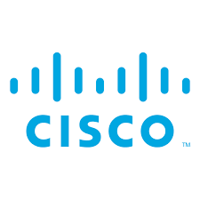

## Experience

<table>
<thead>
<tr>
<th>Company</th>
<th>Link</th>
<th>Role</th>
<th>Dates</th>
<th>Location</th>
</tr>
</thead>
<tbody>
<tr>
<td></td>
<td><a href="https://www.sygnum.com/" target="_blank">Sygnum Bank</a></td>
<td>Senior Software Engineer</td>
<td>2024 - Present</td>
<td>Zurich, Switzerland</td>
</tr>
<tr>
<td rowspan="3"></td>
<td rowspan="3"><a href="https://www.wayfair.com/" target="_blank">Wayfair</a></td>
<td>Senior Software Engineer</td>
<td>2022-2024</td>
<td>Berlin, Germany</td>
</tr>
<tr>
<td>Software Engineer II</td>
<td>2019-2022</td>
<td>Berlin, Germany</td>
</tr>
<tr>
<td>Software Engineer</td>
<td>2018-2019</td>
<td>Berlin, Germany</td>
</tr>
<tr>
<td rowspan="2"></td>
<td rowspan="2"><a href="https://www.meiningers-international.com/wine/news/pernod-ricard-moves-global-e-commerce" target="_blank">Uvinum</a></td>
<td>Software Engineer</td>
<td>2016-2018</td>
<td>Barcelona, Spain</td>
</tr>
<tr>
<td>Junior Software Engineer</td>
<td>2015-2016</td>
<td>Barcelona, Spain</td>
</tr>
</tbody>
</table>

---

## Education

<table>
<thead>
<tr>
<th>School</th>
<th>Link</th>
<th>Degree</th>
<th>Dates</th>
<th>Location</th>
</tr>
</thead>
<tbody>
<tr>
<td rowspan="2"></td>
<td rowspan="2"><a href="https://www.salleurl.edu/" target="_blank">La Salle URL</a></td>
<td>High Performance Web Programming Master's</td>
<td>2015-2016</td>
<td>Barcelona, Spain</td>
</tr>
<tr>
<td>Multimedia Engineering</td>
<td>2010-2015</td>
<td>Barcelona, Spain</td>
</tr>
</tbody>
</table>

---

## Certifications

<table>
<thead>
<tr>
<th>Organization</th>
<th>Link</th>
<th>Certification</th>
<th>Dates</th>
<th>Details</th>
</tr>
</thead>
<tbody>
<tr>
<td></td>
<td><a href="https://www.linuxfoundation.org/" target="_blank">Linux Foundation</a></td>
<td>Kubernetes Administration (LFS458)</td>
<td>Dec 2019</td>
<td>Container Orchestration</td>
</tr>
<tr>
<td></td>
<td><a href="https://www.cisco.com/" target="_blank">Cisco</a></td>
<td>CCNA1</td>
<td>Jun 2013</td>
<td>Network Fundamentals</td>
</tr>
</tbody>
</table>

---

## Languages

- **Español 🇪🇸**: Native
- **English 🇺🇸**: Full Professional Proficiency
- **Deutsch 🇩🇪**: Elementary Proficiency
- **Schwiizerdütsch 🇨🇭**: I can say Chuchichäschtli
